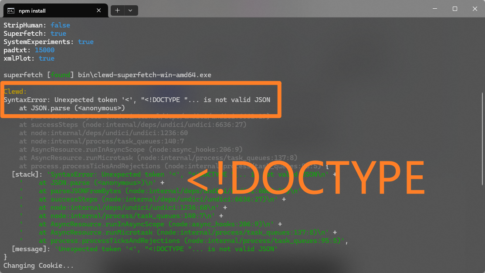
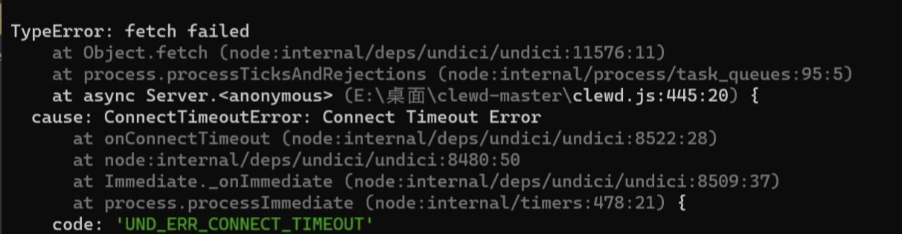
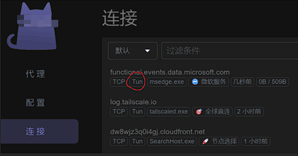
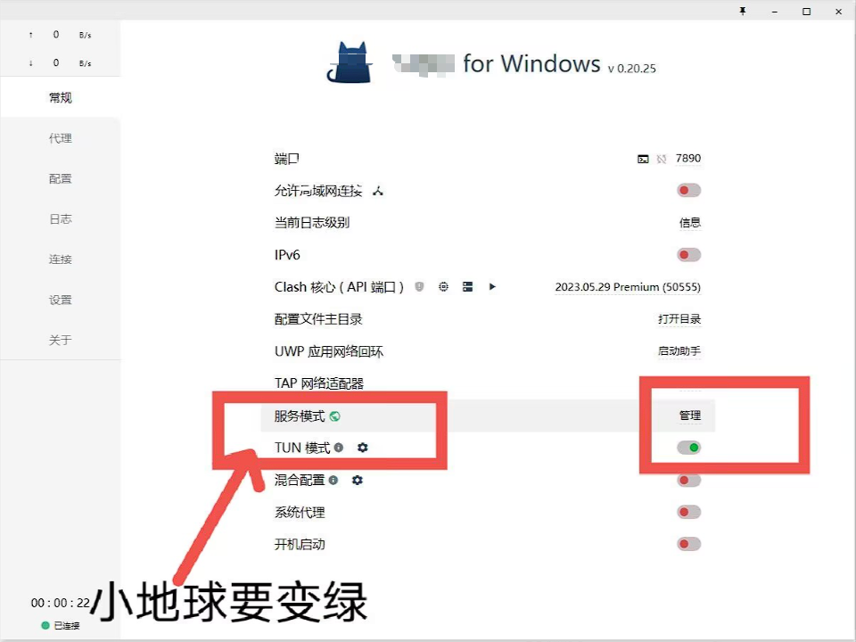
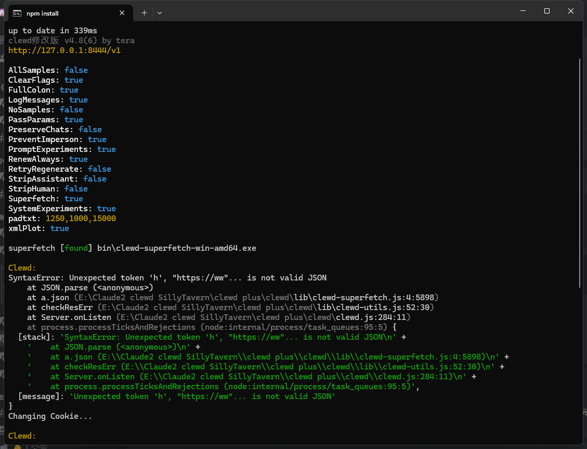

# SillyTavern-Claude3.0-FAQ
FAQ on using Claude 3.0 at SillyTavern.

By March 7th＆东山小红猫＆円円円

1.clewd网络错误

网络错误，请更换节点后重新尝试，必须为非香港节点。

电脑本地部署请先检查服务模式和tun模式是否开启，小地球是否变绿，连接中是否有Tun等。

网络节点存在问题，在确保TUN模式开启后请更换为不同的地区（例如香港->台湾、日本、新加坡、英美等）或者更换其他翻墙软件进行尝试。

部分人也可通过Proxifier强制转发流量来解决，具体请查看https://discord.com/channels/1134557553011998840/1218823519031529594
该错误可能与是否为机房ip有关，请在将翻墙软件开启为全局模式后通过ping0.cc来查看确认。
